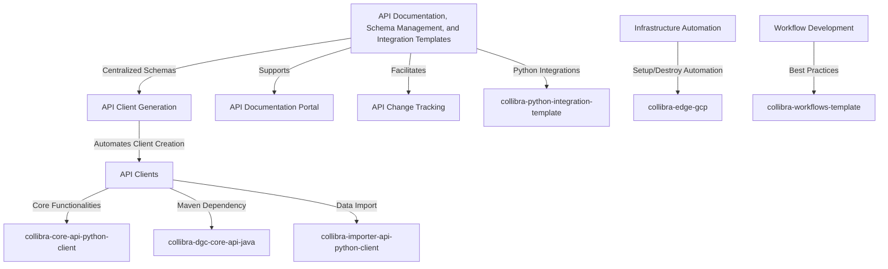

# Hi there, I'm Max 👋

Welcome to my GitHub profile! I'm a passionate developer working at BearingPoint, with a focus on building efficient and scalable solutions. Here’s a bit about me:

I am a dedicated data expert with a strong background in data governance, data architecture, data modeling, data integration, system integration, reference data management, and business analytics. My extensive experience spans across various industries and roles, including freelance consulting, data vault and BI expertise, and enterprise application integration.

I have a deep interest in delivering highly efficient and modular solutions that rely on strong data models for reuse across various data disciplines. My work includes developing roadmaps for data lineage, defining modern data platform architectures, implementing data governance frameworks, and engineering automated data management platforms.

- 🔭 I’m currently leading data governance and integration projects at BearingPoint, contributing to the Collibra ecosystem and developing advanced data solutions.
- 🌱 I’m constantly learning and exploring modern data platform architectures, data governance frameworks, and innovative data integration techniques.
- 👯 I’m looking to collaborate on challenging projects that involve data architecture, data modeling, and system integration to drive business efficiency and innovation.
- 💬 Feel free to ask me about data governance, data integration, data modeling, and advanced analytics.
- 📫 You can reach me at: [ce-maximilien.powis@bearingpoint.com](mailto:ce-maximilien.powis@bearingpoint.com)

## Main Technologies I Work With

Here are some of the key technologies and tools I frequently use in my projects:

| **Category**            | **Technologies**                                                                                                                                                                        |
|-------------------------|----------------------------------------------------------------------------------------------------------------------------------------------------------------------------------------|
| **Data Governance**     |   |
| **Data Integration**    |    |
| **Data Modeling**       |    |
| **Data Platforms**      |     |
| **Data Visualization**  |    |
| **Programming & Scripting** |      |
| **API & Integration**   |     |
| **Version Control & CI/CD** |      |
| **IDEs & Tools**        |    |

## My Approach to System Thinking for Collibra implementations

At BearingPoint, I focus on integrating system thinking into my work to build efficient, scalable, and cohesive solutions. The Collibra ecosystem plays a crucial role in data governance and management, and the repositories I maintain are designed to streamline and enhance integration and automation processes, providing significant value to our users.

### API Documentation, Schema Management, and Integration Templates
The journey begins with [collibra-openapi-schemas](https://github.com/bearingpoint/collibra-openapi-schemas), which centralizes all Collibra OpenAPI schemas. This repository ensures that our API documentation is up-to-date and easily accessible, paving the way for automated client generation and documentation portals.

Next, [collibra-python-clients-generator](https://github.com/bearingpoint/collibra-python-clients-generator) automates the creation of Python API clients. This automation saves valuable development time and ensures consistency across our API clients.

With generated clients like [collibra-core-api-python-client](https://github.com/bearingpoint/collibra-core-api-python-client), [collibra-dgc-core-api-java](https://github.com/bearingpoint/collibra-dgc-core-api-java), and [collibra-importer-api-python-client](https://github.com/bearingpoint/collibra-importer-api-python-client), developers can easily integrate with the Collibra Data Governance Center. These clients provide robust interfaces for accessing core functionalities and specialized data import capabilities.

The [collibra-python-integration-template](https://github.com/bearingpoint/collibra-python-integration-template) provides a robust foundation for developing Python integrations with Collibra, incorporating best practices and powerful tools to deliver high-quality, efficient integrations.

### Infrastructure Automation
To support the deployment and management of Collibra Edge sites, [collibra-edge-gcp](https://github.com/bearingpoint/collibra-edge-gcp) provides Terraform automation scripts. This ensures that our infrastructure is scalable and easily maintainable.

### Workflow Development Templates
The [collibra-workflows-template](https://github.com/bearingpoint/collibra-workflows-template) standardizes best practices and enhances the developer experience around Collibra workflow development projects, featuring external script file management, Groovy syntax support, and dynamic resolution of external file contents.

Together, these repositories form a cohesive value stream that enhances the Collibra ecosystem, driving efficiency, consistency, and reliability in data governance and management. My personal focus on system thinking ensures that each component works seamlessly within the larger system, delivering maximum value.

## GitHub Stats

*Note: Those stats don't include the several internal organization repositories I manage and contribute to!*

## Connect with Me

- [LinkedIn](https://www.linkedin.com/in/maxpowis)

Thanks for visiting my profile! Feel free to check out my repositories and reach out if you want to collaborate or chat.